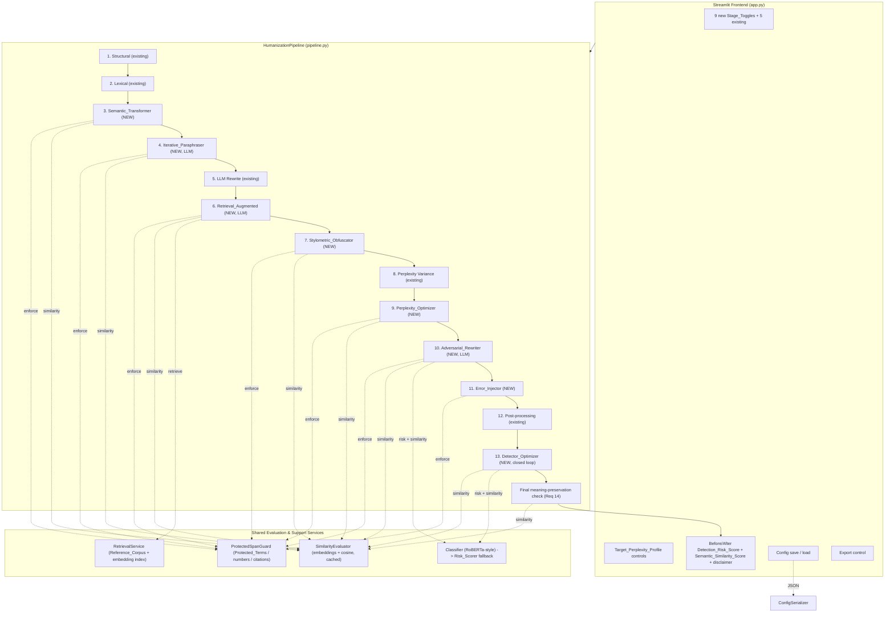
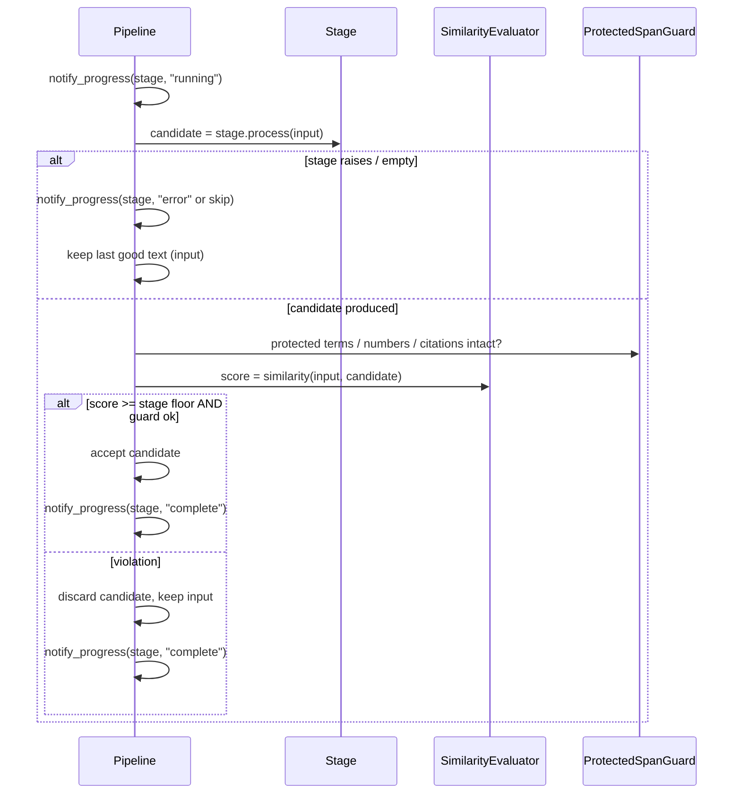
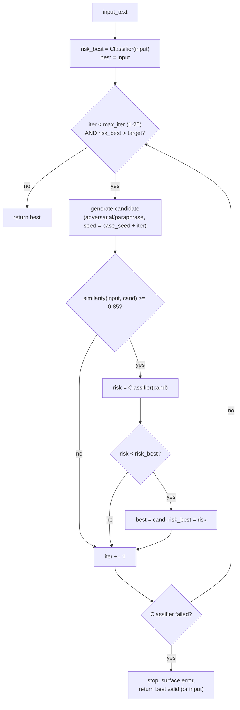

# Design Document: Ultimate Humanizer

## Overview

The **Ultimate Humanizer** extends "The Thesis Forge" from its current five-stage pipeline
(Structural Variation, Lexical Injection, LLM Rewrite, Perplexity Variance, Post-processing) into a
fourteen-component system by adding nine advanced capabilities plus a cross-cutting
meaning-preservation layer. The design is deliberately conservative about the existing code: every
new transformation conforms to the established stage contract
(`__init__(aggression: float, seed: Optional[int], ...)` + `process(text: str) -> str`), so the
`HumanizationPipeline` orchestrator can continue to treat all stages uniformly.

The central new idea is a **measurement-and-fallback layer**. Today the pipeline chains stages and
trusts each one to behave; it never checks whether a stage damaged meaning. The Ultimate Humanizer
introduces a `SimilarityEvaluator` (embedding-based semantic comparison) and a transformer-based
`Classifier` (AI-detection risk), and threads them through every stage so each transformation can be
*measured* and *discarded if it violates a floor*. This is what lets aggressive humanization
(adversarial rewriting, detector-aware optimization, retrieval-augmented rewriting) run safely: a bad
candidate is never returned — the stage falls back to its input.

The design maps to the 14 requirements as follows:

| Requirement | Primary design section |
|---|---|
| 1. Iterative Paraphrasing | Components → `IterativeParaphraser` |
| 2. Stylometric Obfuscation | Components → `StylometricObfuscator` |
| 3. Perplexity Optimization | Components → `PerplexityOptimizer` |
| 4. Adversarial Rewriting | Components → `AdversarialRewriter` |
| 5. Human-Like Error Injection | Components → `ErrorInjector` |
| 6. Semantic-Preserving Transformations | Components → `SemanticTransformer` |
| 7. Retrieval-Augmented Humanization | Components → `RetrievalService` + `RetrievalAugmentedRewriter` |
| 8. Detector-Aware Optimization | Components → `DetectorOptimizer` + Architecture → optimization loop |
| 9. Transformer-Based Classification | Components → `Classifier` |
| 10. Pipeline Integration | Architecture + `HumanizationPipeline` changes |
| 11. Intensity Profile Configuration | Data Models → `INTENSITY_PROFILES` extension |
| 12. UI Controls and Analytics | Components → Streamlit frontend changes |
| 13. Configuration Persistence | Components → `ConfigSerializer` + Data Models |
| 14. Meaning Preservation | Architecture → meaning-preservation check + `SimilarityEvaluator` |

### Research Notes and Key Decisions

A few areas required research/decisions before settling the design:

- **Semantic similarity** (Req 1,2,3,4,6,7,8,14): The cheapest robust option is a sentence-embedding
  model with cosine similarity. We choose `sentence-transformers` with the small `all-MiniLM-L6-v2`
  model (~80 MB, CPU-friendly, ~384-dim embeddings). It is well-suited to short academic passages and
  has a stable, deterministic forward pass in eval mode. Cosine similarity is mapped to `[0,1]` so it
  is directly comparable against the requirement floors (0.80, 0.85, 0.90). Source:
  [sentence-transformers docs](https://www.sbert.net/). *Content was rephrased for compliance with
  licensing restrictions.*
- **Transformer AI-text classifier** (Req 9): A RoBERTa-style sequence-classification model
  fine-tuned for AI-vs-human detection (e.g., an OpenAI-RoBERTa-detector-style checkpoint loaded via
  `transformers`). Output is the model's "AI" class probability scaled to `0-100`. Run locally in
  `torch.no_grad()` eval mode for deterministic, dependency-light scoring. This avoids a per-call
  network dependency and keeps the 5-second budget controllable.
- **Vector store for retrieval** (Req 7): For a bundled corpus of hundreds-to-low-thousands of
  passages, a full vector DB is overkill. We use an in-memory NumPy matrix of precomputed embeddings
  with brute-force cosine top-k (optionally `faiss` if installed). This keeps the dependency surface
  small and the index reproducible.

These add three new dependency groups (embeddings, transformer classifier, optional vector index),
all of which degrade gracefully if unavailable (see Error Handling). The existing heuristics in
`text_analysis.py` remain the fallback for both similarity-free risk scoring and classifier outages.

## Architecture

### Component View

The pipeline keeps its linear orchestration but gains a shared evaluation layer and a closed
optimization loop at the end. The nine new stages slot into a deterministic order around the original
five.



### Stage Execution Order (Req 10.1)

The new stages are interleaved with the existing five in a fixed, deterministic order. The ordering
rationale:

1. **Structural** (existing) — coarse sentence/paragraph restructuring first.
2. **Lexical** (existing) — vocabulary substitution.
3. **Semantic_Transformer** — surface-form transforms with a strict 0.90 similarity gate; runs early
   so later stages build on a meaning-safe base.
4. **Iterative_Paraphraser** (LLM) — multi-pass divergence from AI phrasing.
5. **LLM Rewrite** (existing) — the original two-pass rewrite.
6. **Retrieval_Augmented** (LLM) — grounds style in human reference passages.
7. **Stylometric_Obfuscator** — disrupts stylometric fingerprints (operates on near-final prose).
8. **Perplexity Variance** (existing) — NLP variance injection.
9. **Perplexity_Optimizer** — tunes toward the Target_Perplexity_Profile.
10. **Adversarial_Rewriter** (LLM) — reduces detector signal.
11. **Error_Injector** — injects bounded human-like imperfections.
12. **Post-processing** (existing) — final cleanup.
13. **Detector_Optimizer** — closed-loop optimization over the *already-humanized* text; runs last so
    it optimizes the true final form.

The orchestrator stores this order in an extended `STAGE_NAMES` / `STAGE_ORDER` structure. Disabled
stages (via `Stage_Toggle` or `Intensity_Profile`) are simply skipped, but the relative order of the
remaining stages is invariant (Req 10.1, 10.2, 10.3).

### Per-Stage Discard-on-Violation Wrapper (Req 10.7, 14)

The orchestrator wraps every new stage in a uniform guard so the existing `process(text) -> str`
contract is preserved while adding measurement and fallback:



Note: stages also enforce their own floors internally (the requirements assign the floor to the stage,
e.g. Req 2.9, 4.5, 6.3). The pipeline-level guard is a defense-in-depth backstop and the source of the
`StageResult` analytics surfaced to the UI. Each stage's `process()` remains individually correct and
callable in isolation.

### Detector-Aware Optimization Loop (Req 8)

The `DetectorOptimizer` is the only stateful, iterative component. It re-applies candidate-generating
transformations (adversarial rewrite and/or paraphrase) with varied seeds/parameters, scores each
candidate with the `Classifier`, gates on the 0.85 similarity floor, and returns the lowest-risk valid
candidate.



Key behaviors: candidates that fail the similarity gate are never selected (Req 8.3, 8.4); if no
candidate ever passes the gate, the original stage input is returned unchanged (Req 8.5); iterations
are hard-bounded to the configured maximum (Req 8.2, 8.6); a mid-loop classifier failure stops
iteration and returns the best valid candidate so far plus an error indication (Req 8.8).

## Components and Interfaces

All new transformation stages follow the existing contract. LLM-backed stages additionally accept
`model`, `api_key`, and `base_url` and reuse the `LLMRewriter` HTTP/SSE/`timeout` pattern.

### Shared: `StageResult` and the evaluation helpers

To support discard-on-violation and UI analytics without breaking `process(text) -> str`, stages
optionally expose a richer `process_measured()` that returns a `StageResult`. The plain `process()`
delegates to it and returns only the text.

```python
@dataclass
class StageResult:
    text: str                       # transformed (or fallback) text
    similarity: Optional[float]     # 0.0-1.0 vs stage input, None if not computed
    risk_before: Optional[float]    # 0-100, None if not measured
    risk_after: Optional[float]     # 0-100, None if not measured
    changed: bool                   # True if text differs from input
    fell_back: bool                 # True if a violation/error forced fallback
    error: Optional[str]            # error indication if any
```

### `SimilarityEvaluator` (Req 1,2,3,4,6,7,8,14)

```python
class SimilarityEvaluator:
    def __init__(self, model_name="all-MiniLM-L6-v2", cache_size=512): ...
    def is_available(self) -> bool: ...
    def score(self, a: str, b: str) -> float:   # cosine mapped to 0.0-1.0
        ...
```

- Lazily loads the sentence-embedding model on first use; caches the loaded model process-wide.
- Caches embeddings by text hash (LRU) so repeated comparisons in the optimization loop are cheap.
- Cosine similarity `c` in `[-1,1]` is clamped/normalized into `[0,1]` (e.g. `max(0.0, min(1.0, c))`,
  since academic-paraphrase cosine stays positive in practice), guaranteeing the `[0,1]` range
  required by Req 6.2 and 14.1.
- **Graceful degradation**: if the embedding model cannot load, `is_available()` returns `False` and
  `score()` falls back to a lexical proxy (token Jaccard / normalized overlap) so stages still get a
  number. When the proxy is used, the pipeline surfaces a notice that embedding-based similarity was
  unavailable, consistent with the requirements' fallback philosophy. Floors are still enforced
  against whatever score source is active.
- **Cost note**: first call pays model-load latency (~1-3 s CPU). Subsequent calls are milliseconds
  for short academic passages.

### `Classifier` (Req 9) and `RiskScorer` fallback

```python
class Classifier:
    MAX_CHARS = 10_000
    def __init__(self, model_name=DETECTOR_MODEL, timeout_s=5): ...
    def is_available(self) -> bool: ...
    def score(self, text: str) -> float:    # 0-100, deterministic; raises InvalidInput
        ...

def detection_risk_score(text: str, classifier: Optional[Classifier]) -> tuple[float, str]:
    """Returns (score 0-100, source) where source is 'classifier' or 'heuristic'."""
```

- Loads a RoBERTa-style AI-text detector via `transformers` once; runs in `torch.no_grad()` eval mode
  so identical input yields identical output (Req 9.2).
- Rejects empty input and input over 10,000 characters with an invalid-input indication (Req 9.6).
- Enforces a 5-second budget; on load failure, inference error, or timeout it falls back to the
  existing `compute_ai_risk_score` heuristic and surfaces that the fallback was used (Req 9.4). The
  `detection_risk_score()` helper centralizes this fallback so every consumer (Adversarial_Rewriter,
  Detector_Optimizer, UI analytics) uses the same scorer for both input and output (Req 4.1, 9.3).
- Both Classifier and heuristic expose the identical `text -> 0-100` interface so they are
  interchangeable.

### `IterativeParaphraser` (Req 1)

```python
class IterativeParaphraser:
    def __init__(self, aggression=0.5, seed=None, model=None, api_key=None,
                 base_url=None, similarity=None, timeout_s=30): ...
    def process(self, text: str) -> str: ...
    def process_measured(self, text: str) -> StageResult: ...
```

- Pass count = `1 + round(aggression * 4)` → 1 pass at 0.0, up to 5 at 1.0 (Req 1.2), monotonic.
- Each pass feeds the previous pass's output (Req 1.3); a pass whose similarity vs the *stage input*
  is below 0.80 is discarded and the previous pass output retained (Req 1.5).
- Reuses the `LLMRewriter` SSE pattern with a 30-second per-pass timeout (Req 1.9). LLM error/empty
  with a prior success → return last good pass (Req 1.6); first-pass failure with no prior success →
  return original text (Req 1.8).
- Protected_Terms preserved via `ProtectedSpanGuard` (Req 1.4). Seed determinism applies to any
  non-LLM randomized selection (Req 1.7).

### `StylometricObfuscator` (Req 2)

```python
class StylometricObfuscator:
    def __init__(self, aggression=0.5, seed=None, similarity=None,
                 variance_threshold=STYLO_VARIANCE_THRESHOLD): ...
    def process(self, text: str) -> str: ...
```

- NLP-only (no LLM). Adjusts sentence-length distribution, function-word frequency, punctuation
  pattern, and type-token ratio so at least one shifts by ≥5% when aggression > 0 (Req 2.1), using
  `compute_sentence_length_variance`, `compute_type_token_ratio` from `text_analysis.py`.
- Targets a ≥10% increase in sentence-length variance, or leaves it within ±2% when already at the
  human threshold (Req 2.2). Higher aggression → larger distributional adjustment (Req 2.5).
- Returns input unchanged when aggression is 0.0 (Req 2.7) or fewer than 2 sentences (Req 2.8).
- Enforces a 0.85 similarity floor; if no adjustment meets it, discards and returns a ≥0.85 result
  (which may be the input) (Req 2.4, 2.9). Seed-deterministic (Req 2.6). Protected_Terms preserved
  (Req 2.3).

### `PerplexityOptimizer` (Req 3)

```python
class PerplexityOptimizer:
    def __init__(self, aggression=0.5, seed=None, target_profile=None,
                 similarity=None, mean_tol=PPX_MEAN_TOL, var_tol=PPX_VAR_TOL): ...
    def process(self, text: str) -> str: ...
```

- Accepts a `Target_Perplexity_Profile` (target mean > 0, target variance ≥ 0) (Req 3.1).
- Uses `estimate_perplexity_score` per sentence; greedily applies candidate edits (simplify/complexify
  sentences, like `PerplexityVariance`) that move measured mean perplexity no further from target,
  and likewise for cross-sentence variance when ≥2 sentences (Req 3.2, 3.3). Only accepts a candidate
  if it does not increase the distance to target — guaranteeing the "≤" inequalities.
- Returns input unchanged when already within both tolerances (Req 3.5), when empty/whitespace
  (Req 3.8), or when perplexity cannot be measured (Req 3.9). 0.85 similarity floor (Req 3.6),
  seed-deterministic (Req 3.7), Protected_Terms preserved (Req 3.4).

### `AdversarialRewriter` (Req 4)

```python
class AdversarialRewriter:
    def __init__(self, aggression=0.5, seed=None, model=None, api_key=None,
                 base_url=None, similarity=None, classifier=None, timeout_s=30): ...
    def process(self, text: str) -> str: ...
    def process_measured(self, text: str) -> StageResult: ...
```

- LLM-backed (reuses `LLMRewriter` HTTP/SSE/30s timeout). Prompt instructs detector-evasion rewriting.
- Scores risk on input and candidate with the *same* scorer (`detection_risk_score`) (Req 4.1).
- Returns input unchanged if candidate similarity < 0.85 (Req 4.5), if candidate risk > input risk
  (Req 4.6), on LLM error/empty/timeout (Req 4.7), or on empty/whitespace input (Req 4.8).
- Higher aggression → word-change proportion non-decreasing (Req 4.4), implemented by scaling rewrite
  strength in the prompt and accepting the more-changed candidate. Protected_Terms preserved (Req 4.2),
  0.85 similarity floor (Req 4.3).

### `ErrorInjector` (Req 5)

```python
class ErrorInjector:
    def __init__(self, aggression=0.5, seed=None, max_alter_ratio=0.05): ...
    def process(self, text: str) -> str: ...
```

- NLP-only. Injects minor punctuation variations, whitespace variations, and informal word-form
  substitutions at a rate monotonic in aggression (Req 5.1), capped at 5% of total words,
  `floor(0.05 * word_count)` (Req 5.2, 5.8).
- Never alters numeric values, citations, or quoted content (Req 5.4), and preserves Protected_Terms
  (Req 5.3) — both via `ProtectedSpanGuard` masking before injection.
- Returns input unchanged at aggression 0.0 (Req 5.5) or empty/whitespace input (Req 5.7).
  Seed-deterministic (Req 5.6).

### `SemanticTransformer` (Req 6)

```python
class SemanticTransformer:
    def __init__(self, aggression=0.5, seed=None, similarity=None,
                 floor=0.90): ...
    def process(self, text: str) -> str: ...
    def process_measured(self, text: str) -> StageResult: ...
```

- Produces a candidate whose character sequence differs from input for non-empty input (Req 6.1),
  computes a `[0,1]` similarity between input and candidate (Req 6.2), and discards the candidate
  (returns input unchanged) when similarity < 0.90 (Req 6.3) — note the stricter 0.90 floor here.
- Exposes the computed score via `StageResult` for UI/pipeline display (Req 6.5). Returns input
  unchanged and computes no score on empty input (Req 6.7), and on source error/empty (Req 6.8).
  Seed-deterministic for non-LLM randomization (Req 6.6). Protected_Terms preserved (Req 6.4).

### `RetrievalService` + `RetrievalAugmentedRewriter` (Req 7)

```python
class RetrievalService:
    def __init__(self, corpus_path=None, embedder=None, max_results=10): ...
    def retrieve(self, query_text: str) -> list[ReferenceEntry]:   # ranked, <=10
        ...

class RetrievalAugmentedRewriter:
    def __init__(self, aggression=0.5, seed=None, model=None, api_key=None,
                 base_url=None, retrieval=None, similarity=None,
                 max_verbatim_words=8, timeout_s=30): ...
    def process(self, text: str) -> str: ...
```

- `RetrievalService` maintains a `Reference_Corpus` of human-written passages with precomputed
  embeddings, returning up to 10 passages ranked by embedding cosine similarity to the input
  (Req 7.1, 7.2). **Corpus sourcing** is a configuration/data concern: the system bundles a small
  default corpus of public-domain / openly-licensed academic prose, and the corpus path is
  configurable so users can supply their own. (Documented as a data-sourcing concern, not hard-coded
  scraping.)
- The rewriter uses retrieved passages as *style guidance only* in the LLM prompt (Req 7.3), and a
  post-generation guard rejects any output containing a span of >8 consecutive words copied verbatim
  from any retrieved passage (Req 7.7).
- Returns input unchanged when corpus empty / no results (Req 7.4), on source error/empty (Req 7.8),
  and when rewrite similarity < 0.85 (Req 7.9). 0.85 similarity floor (Req 7.6), Protected_Terms
  preserved (Req 7.5).

### `DetectorOptimizer` (Req 8)

```python
class DetectorOptimizer:
    def __init__(self, aggression=0.5, seed=None, model=None, api_key=None,
                 base_url=None, classifier=None, similarity=None,
                 target_threshold=20, max_iterations=10): ...
    def process(self, text: str) -> str: ...
    def process_measured(self, text: str) -> StageResult: ...
```

- Implements the closed loop in the Architecture section: computes risk `0-100` for input and every
  candidate (Req 8.1); iterates until target threshold reached or max iterations (1-20) hit
  (Req 8.2, 8.6); returns the lowest-risk candidate among those with similarity ≥ 0.85 (Req 8.3, 8.4);
  returns input unchanged if none qualify (Req 8.5); preserves Protected_Terms (Req 8.7); on classifier
  failure mid-loop, stops, returns best valid candidate (or input), and surfaces an error (Req 8.8).
- Candidate generation reuses `AdversarialRewriter`/`IterativeParaphraser` with
  `seed = base_seed + iteration` for varied-but-reproducible candidates.

### `ConfigSerializer` (Req 13)

```python
class ConfigSerializer:
    @staticmethod
    def serialize(config: PipelineConfig) -> str:        # JSON string
        ...
    @staticmethod
    def deserialize(blob: str) -> PipelineConfig:        # raises ConfigError(field) on invalid
        ...
```

- Serializes intensity level (1-5), every Stage_Toggle, both Target_Perplexity_Profile values, and
  every per-stage aggression (0.0-1.0) to JSON (Req 13.1) and back to a Pipeline-usable config
  (Req 13.2). Round-trip equivalence is field-by-field identity (Req 13.3).
- On a missing field or out-of-range value, raises an error naming the invalid field and the active
  configuration is left unchanged (Req 13.4).

### Pipeline orchestrator changes (`HumanizationPipeline`, Req 10, 14)

- `STAGE_NAMES`/`STAGE_ORDER` extended with the nine new keys in the fixed order above.
- `get_enabled_stages()` reads enabled flags from the extended `INTENSITY_PROFILES` and applies
  `stage_overrides` exactly as today (Req 10.2, 10.3, 11.4).
- Each new stage executes inside the discard-on-violation wrapper, emitting `progress_callback`
  `running`/`complete` for enabled stages and nothing for skipped ones (Req 10.4, 10.5, 10.6);
  unhandled stage errors keep the last good text, emit status `error`, and continue (Req 10.7).
- Seed is passed to every non-LLM-random stage (Req 10.8). All stages disabled → input unchanged
  (Req 10.9); empty/whitespace input → input unchanged (Req 10.10).
- After the last stage, a **final meaning-preservation check** computes similarity between the
  *original* input and the final output (Req 14.1); if below 0.85 the output is still returned but a
  warning is surfaced (Req 14.3). A `ProtectedSpanGuard.verify()` confirms Protected_Terms,
  numeric values, and citation markers retain identical occurrence counts; any drop surfaces a warning
  (Req 14.2, 14.4, 14.5).

### Streamlit frontend changes (`app.py`, Req 12)

- Adds nine Stage_Toggle checkboxes (one per new capability) alongside the existing five, each
  defaulting to its Intensity_Profile enabled flag and overriding it when changed (Req 12.1).
- Adds Target_Perplexity_Profile inputs (target mean, target variance).
- Progress display updates each enabled stage to running/complete within 1 s of each callback
  (Req 12.2).
- On completion, displays before/after Detection_Risk_Score (0-100) and the final
  Semantic_Similarity_Score (0.0-1.0) between original and final text (Req 12.3, 12.4), plus the
  estimate disclaimer (Req 12.5).
- Export produces a downloadable file with the full final text (Req 12.6); the export control is
  disabled until a run completes in the session (Req 12.8). On run error, shows an error indication
  and retains the last successful analytics (Req 12.7).
- Adds config save (download JSON via `ConfigSerializer.serialize`) and load (upload → `deserialize`,
  invalid → field-named error, keep current config) (Req 13).

## Data Models

### `Target_Perplexity_Profile`

```python
@dataclass
class TargetPerplexityProfile:
    target_mean: float       # > 0
    target_variance: float   # >= 0
```

### `StageResult`

(Defined above in Components.) Carries transformed text plus measured `similarity`, `risk_before`,
`risk_after`, `changed`, `fell_back`, and `error`. Enables both discard-on-violation and UI analytics
while `process()` continues to return a plain string.

### `ReferenceEntry` (Reference_Corpus entry)

```python
@dataclass
class ReferenceEntry:
    id: str
    text: str                       # human-written passage
    source: str                     # provenance / license note
    embedding: Optional[np.ndarray] # precomputed; lazily built if missing
```

### Extended `INTENSITY_PROFILES` (Req 11)

Each level 1-5 gains, for each of the nine new stages, an `<stage>` enabled boolean and an
`<stage>_aggression` float in `[0,1]`. Aggression is **monotonic non-decreasing** across levels for
every stage (Req 11.3). Illustrative values (final values tuned during implementation):

| Stage key | L1 | L2 | L3 | L4 | L5 |
|---|---|---|---|---|---|
| `semantic_transform` | 0.1 | 0.3 | 0.5 | 0.7 | 0.9 |
| `iterative_paraphrase` | 0.0 | 0.2 | 0.4 | 0.7 | 1.0 |
| `retrieval_augmented` | 0.0 | 0.2 | 0.4 | 0.6 | 0.9 |
| `stylometric` | 0.1 | 0.3 | 0.5 | 0.7 | 0.9 |
| `perplexity_optimize` | 0.0 | 0.2 | 0.4 | 0.6 | 0.8 |
| `adversarial` | 0.0 | 0.2 | 0.4 | 0.7 | 0.9 |
| `error_injection` | 0.0 | 0.1 | 0.3 | 0.5 | 0.7 |
| `detector_optimize` | 0.0 | 0.2 | 0.4 | 0.6 | 0.9 |
| `classifier` (always-available scorer; enabled flag gates use as risk source) | n/a aggression |

Enabled flags follow the existing pattern (lighter levels enable fewer/cheaper stages; LLM-backed and
loop stages enable at higher levels).

### Persisted Config Schema (Req 13)

```json
{
  "version": 1,
  "intensity": 4,
  "stage_toggles": {
    "structural": true, "lexical": true, "llm_rewrite": true,
    "perplexity": true, "postprocess": true,
    "semantic_transform": true, "iterative_paraphrase": true,
    "retrieval_augmented": false, "stylometric": true,
    "perplexity_optimize": true, "adversarial": true,
    "error_injection": true, "detector_optimize": false
  },
  "target_perplexity_profile": { "target_mean": 45.0, "target_variance": 120.0 },
  "stage_aggression": {
    "structural_aggression": 0.7, "lexical_aggression": 0.7,
    "llm_aggression": 0.75, "perplexity_aggression": 0.6,
    "postprocess_aggression": 0.7, "semantic_transform_aggression": 0.7,
    "iterative_paraphrase_aggression": 0.7, "retrieval_augmented_aggression": 0.6,
    "stylometric_aggression": 0.7, "perplexity_optimize_aggression": 0.6,
    "adversarial_aggression": 0.7, "error_injection_aggression": 0.5,
    "detector_optimize_aggression": 0.6
  }
}
```

Validation: every field required; `intensity` ∈ [1,5]; all aggression values ∈ [0,1]; toggles boolean;
`target_mean` > 0; `target_variance` ≥ 0. Missing/out-of-range → `ConfigError(field_name)`, active
config retained (Req 13.4).


## Correctness Properties

*A property is a characteristic or behavior that should hold true across all valid executions of a
system — essentially, a formal statement about what the system should do. Properties serve as the
bridge between human-readable specifications and machine-verifiable correctness guarantees.*

The properties below are the result of the acceptance-criteria prework plus a redundancy-elimination
pass. Many criteria share the same shape (protected-term invariance, similarity floors, seed
determinism, score ranges); these are expressed once as parameterized properties applied across the
relevant stages rather than repeated per stage. Failure-handling criteria, pure UI/timing criteria,
and one-time setup criteria are validated by example/integration/smoke tests in the Testing Strategy
and are not restated as properties.

### Property 1: Protected-span invariance

*For all* input texts and for every transformation stage T in {Iterative_Paraphraser,
Stylometric_Obfuscator, Perplexity_Optimizer, Adversarial_Rewriter, Error_Injector,
Semantic_Transformer, Retrieval_Augmented, Detector_Optimizer} and the full Pipeline, the occurrence
count of every Protected_Terms entry (case-sensitive, whole-word) in the output equals its occurrence
count in the input.

**Validates: Requirements 1.4, 2.3, 3.4, 4.2, 5.3, 6.4, 7.5, 8.7, 14.2**

### Property 2: Numeric and citation preservation

*For all* input texts, the Error_Injector output and the final Pipeline output preserve every numeric
value and citation marker present in the input with identical values and identical occurrence counts.

**Validates: Requirements 5.4, 14.4**

### Property 3: Similarity-floor guarantee (parameterized)

*For all* input texts and for every stage S with floor f_S (f = 0.85 for Stylometric_Obfuscator,
Perplexity_Optimizer, Adversarial_Rewriter, Retrieval_Augmented, Detector_Optimizer, and the final
Pipeline check; f = 0.90 for Semantic_Transformer; f = 0.80 for an accepted Iterative_Paraphraser
pass), the Semantic_Similarity_Score between the stage input and the returned output is greater than
or equal to f_S, where returning the input unchanged trivially satisfies the floor.

**Validates: Requirements 1.5, 2.4, 2.9, 3.6, 4.3, 4.5, 6.3, 7.6, 7.9, 8.4, 8.5**

### Property 4: Seed / loaded-model determinism (parameterized)

*For all* input texts, for every stage that performs non-LLM randomized selection
(Iterative_Paraphraser, Stylometric_Obfuscator, Perplexity_Optimizer, Error_Injector,
Semantic_Transformer) given an identical Seed, and for the Classifier given a fixed loaded model, two
invocations on identical input produce identical output.

**Validates: Requirements 1.7, 2.6, 3.7, 5.6, 6.6, 9.2**

### Property 5: Score-range validity (parameterized)

*For all* texts, every Detection_Risk_Score produced by the Classifier or fallback Risk_Scorer lies in
the inclusive range 0 to 100, and every Semantic_Similarity_Score produced by the SimilarityEvaluator
(per-stage and the final Pipeline score) lies in the inclusive range 0.0 to 1.0.

**Validates: Requirements 6.2, 8.1, 9.1, 14.1**

### Property 6: Iterative paraphrase produces divergence

*For all* non-empty input texts, when the Iterative_Paraphraser runs with at least one successful pass,
the output text's Lexical_Divergence from the input text is greater than 0.

**Validates: Requirements 1.1**

### Property 7: Paraphrase pass-count monotonicity

*For all* aggression values in the range 0.0 to 1.0, the number of paraphrasing passes is at least 1,
at most 5, equals 1 at aggression 0.0, reaches 5 at aggression 1.0, and is non-decreasing as
aggression increases.

**Validates: Requirements 1.2**

### Property 8: Stylometric attribute shift

*For all* input texts with at least 2 sentences and aggression greater than 0.0, the
Stylometric_Obfuscator output differs from the input in at least one of {sentence-length distribution,
function-word frequency distribution, punctuation pattern distribution, type-token ratio} by at least
5 percent; and the output sentence-length variance is at least 10 percent greater than the input's, or
within plus/minus 2 percent of the input's when the input already meets the human-writing variance
threshold.

**Validates: Requirements 2.1, 2.2**

### Property 9: Stylometric adjustment monotonicity

*For all* input texts and Seeds, the magnitude of distributional adjustment applied by the
Stylometric_Obfuscator at a higher aggression value is greater than or equal to the magnitude applied
at any lower aggression value.

**Validates: Requirements 2.5**

### Property 10: Perplexity distance non-increase

*For all* non-empty input texts and Target_Perplexity_Profiles, the absolute distance between the
Perplexity_Optimizer output's mean perplexity and the target mean is less than or equal to that of the
input; and for inputs with at least 2 sentences, the absolute distance between the output's
cross-sentence perplexity variance and the target variance is less than or equal to that of the input.

**Validates: Requirements 3.2, 3.3**

### Property 11: Adversarial risk non-increase

*For all* input texts containing at least one non-whitespace character, the Detection_Risk_Score of the
Adversarial_Rewriter output, computed by the same scorer applied to both input and output, is less than
or equal to the Detection_Risk_Score of the input (returning the input unchanged trivially satisfies
this).

**Validates: Requirements 4.1, 4.6**

### Property 12: Adversarial change monotonicity

*For all* input texts (with Seed and LLM behavior held fixed), the proportion of input-text words
changed by the Adversarial_Rewriter at a higher aggression value is greater than or equal to the
proportion changed at any lower aggression value.

**Validates: Requirements 4.4**

### Property 13: Error-injection bound and monotonicity

*For all* input texts, the Error_Injector alters at most floor(0.05 × word_count) words, alters zero
words when that bound is less than one, and alters a number of words that is non-decreasing as
aggression increases up to that bound.

**Validates: Requirements 5.1, 5.2, 5.8**

### Property 14: Retrieval top-k ranking

*For all* non-empty query texts and Reference_Corpora, the Retrieval_Service returns at most 10
passages ordered by non-increasing embedding relevance to the query.

**Validates: Requirements 7.2**

### Property 15: Verbatim-span bound

*For all* outputs of the Retrieval_Augmented stage and all retrieved reference passages, no span of
more than 8 consecutive words from any retrieved passage appears verbatim in the output.

**Validates: Requirements 7.7**

### Property 16: Detector-optimizer selection and iteration bound

*For all* input texts, given the candidates generated, the Detector_Optimizer returns the candidate
with the lowest observed Detection_Risk_Score among candidates whose Semantic_Similarity_Score to the
stage input is at least 0.85, returns the input unchanged when no such candidate exists, and performs
no more than the configured maximum number of iterations (an integer in 1 to 20), stopping early once
the target threshold is reached.

**Validates: Requirements 8.2, 8.3, 8.4, 8.5, 8.6**

### Property 17: Classifier invalid-input rejection

*For all* inputs that are empty or exceed 10,000 characters, the Classifier rejects the input with an
invalid-input indication rather than returning a score.

**Validates: Requirements 9.6**

### Property 18: Pipeline executed-set and deterministic order

*For all* configurations and input texts, the set of stages the Pipeline executes equals the set of
enabled stages, the executed stages appear in the canonical stage order, the executed order is
identical across runs for identical configuration and input, no Progress_Callback is emitted for a
skipped stage, and when all stages are disabled the Pipeline returns the input unchanged.

**Validates: Requirements 10.1, 10.2, 10.3, 10.6, 10.9**

### Property 19: Intensity profile structure and monotonicity

*For all* integer levels 1 through 5 and all nine new stages, the Intensity_Profile defines a boolean
enabled flag and an aggression float in 0.0 to 1.0; and for each stage and each adjacent level pair
(L, L+1) with L in 1 through 4, the aggression at L+1 is greater than or equal to the aggression at L.

**Validates: Requirements 11.1, 11.3**

### Property 20: Intensity application, clamping, and rounding

*For all* requested intensity values, the Pipeline applies the enabled flags and aggression values of
the resolved profile; values below 1 clamp to level 1 and values above 5 clamp to level 5; and
non-integer values within 1 to 5 round to the nearest integer level with halves rounding up.

**Validates: Requirements 11.2, 11.5, 11.6**

### Property 21: Stage-toggle override semantics

*For all* configurations with a Stage_Toggle override for a new stage, the Pipeline uses the override
value to decide whether the stage executes while still applying the Intensity_Profile aggression value
for that stage.

**Validates: Requirements 11.4**

### Property 22: Config round-trip equivalence

*For all* valid configurations, deserializing the result of serializing a configuration produces a
configuration equal to the original field-by-field across intensity level, every Stage_Toggle state,
both Target_Perplexity_Profile values, and every per-stage aggression value.

**Validates: Requirements 13.1, 13.2, 13.3**

### Property 23: Config invalid-field rejection

*For all* persisted representations with a missing field or an out-of-range value, the Config_Serializer
returns an error identifying the invalid field and the active configuration is left unchanged.

**Validates: Requirements 13.4**

## Error Handling

The system favors **graceful degradation and fallback-to-input** over hard failures, so a single
failing stage never aborts a humanization run.

### Stage-level failures (Req 1.6, 1.8, 4.7, 6.8, 7.8, 10.7)

- **LLM error / empty / timeout**: LLM-backed stages (Iterative_Paraphraser, Adversarial_Rewriter,
  Retrieval_Augmented, plus the existing LLMRewriter) catch `RuntimeError` from the shared SSE helper
  and the 30-second `requests` timeout. Behavior: return the most recent good text (last successful
  pass, or the stage input). The Iterative_Paraphraser specifically returns the original input when the
  *first* pass fails with no prior success (Req 1.8).
- **Unhandled stage exception**: the orchestrator's discard-on-violation wrapper catches any unexpected
  exception, retains the last completed stage's text (or original input), emits
  `progress_callback(stage, "error")`, and continues with the next enabled stage (Req 10.7).
- **Similarity-floor violation**: when a candidate falls below the stage's floor, the candidate is
  discarded and the stage input is returned — never a worse-meaning output (Req 1.5, 2.9, 4.5, 6.3,
  7.9, 8.5).

### SimilarityEvaluator degradation (Req 14, cross-cutting)

If the sentence-embedding model cannot load, `SimilarityEvaluator.is_available()` returns `False` and
`score()` switches to a lexical-overlap proxy so floors can still be enforced and analytics still
produced. The Pipeline surfaces a one-time notice that embedding-based similarity was unavailable.

### Classifier degradation (Req 9.4)

If the transformer Classifier cannot be loaded, errors during inference, or exceeds its 5-second
budget, `detection_risk_score()` falls back to the heuristic `compute_ai_risk_score` and surfaces an
indication that the fallback Risk_Scorer was used. Crucially, the *same* scorer instance is applied to
both input and output within a single comparison so the monotonicity guarantees (Req 4.1, 8) remain
valid even under fallback.

### Classifier invalid input (Req 9.6)

Empty input or input over 10,000 characters raises an `InvalidInput` indication; callers (the UI and
the optimizer) handle it without crashing.

### Detector-optimizer mid-loop failure (Req 8.8)

If the risk source fails during iteration, the optimizer stops, returns the best valid candidate found
so far (similarity ≥ 0.85) or the stage input when none exists, and surfaces an error indication via
`StageResult.error`.

### Config errors (Req 13.4)

`ConfigSerializer.deserialize` validates every field; a missing field or out-of-range value raises
`ConfigError(field_name)`. The UI catches it, displays which field was invalid, and leaves the active
configuration unchanged.

### UI-level failures (Req 12.7)

If a run terminates with an error, the frontend shows an error indication and retains the last
successful analytics rather than clearing them. The export control remains disabled until a run
completes successfully in the session (Req 12.8).

### Pipeline meaning-preservation warnings (Req 14.3, 14.5)

The final check always returns the output text, but surfaces a warning when end-to-end similarity is
below 0.85, or when any numeric value or citation marker was dropped. These are advisory, not
blocking.

## Testing Strategy

The system uses a **dual approach**: property-based tests for the universal guarantees above, and
example/integration/smoke tests for failure handling, wiring, UI behavior, and one-time setup.

### Property-based tests

- **Library**: `hypothesis` (Python) — added to the dev dependencies. We do not hand-roll generators
  beyond domain-specific strategies.
- **Iterations**: each property test runs a minimum of 100 examples
  (`@settings(max_examples=100)` or higher).
- **Tagging**: each property test is tagged with a comment referencing its design property in the form
  **Feature: ultimate-humanizer, Property {number}: {property_text}**.
- **Coverage**: one property-based test per correctness property (Properties 1-23). Shared
  parameterized properties (1, 3, 4, 5) are implemented as parameterized tests iterating over the
  applicable stages/floors.
- **Custom strategies**:
  - Academic-text strategy that injects Protected_Terms, numbers (e.g. `3.14`, `42%`), citation
    markers (e.g. `(Smith, 2020)`, `[12]`), and quoted spans, so invariance properties (1, 2) are
    meaningfully exercised.
  - Multi-sentence strategy (≥2 / ≥3 sentences) for stylometric and perplexity properties.
  - Aggression strategy over `floats(0.0, 1.0)` for monotonicity properties (7, 9, 12, 13, 19).
  - Config strategy generating valid `PipelineConfig` instances for the round-trip property (22) and
    malformed configs for the invalid-field property (23).

### Mocking model- and LLM-backed dependencies

The new dependencies (LLM API, sentence embeddings, transformer classifier, retrieval index) must be
isolated so property tests are deterministic, fast, and offline:

- **LLM stages**: patch the shared `_llm_pass_stream` / `requests.post` (the existing LLMRewriter
  pattern) with fakes that return controllable text, raise `RuntimeError`, return empty, or simulate a
  timeout. This drives the failure-handling examples (1.6, 1.8, 4.7, 7.8) and lets divergence/risk
  properties run without network access.
- **SimilarityEvaluator**: inject a fake evaluator returning scripted scores so floor properties
  (Property 3) can deterministically force both accept and discard paths, and so the embedding model is
  never loaded in unit tests. A separate, marked integration test exercises the real embedding model.
- **Classifier**: inject a fake classifier with deterministic, scriptable scores for risk-monotonicity
  (11), optimizer selection (16), and range (5) properties; test the real model load + 5s budget +
  fallback in a marked integration test (9.1, 9.4).
- **RetrievalService**: build in-memory corpora with known embeddings so ranking (14) and verbatim-span
  (15) properties are exact and reproducible.

### Example / integration / smoke tests

- **Examples**: pass-chaining (1.3), LLM failure recovery (1.6, 1.8, 4.7, 6.8, 7.8), timeout handling
  (1.9), classifier wiring and fallback indication (9.3, 9.4, 9.5), optimizer mid-loop failure (8.8),
  progress-callback running→complete sequencing (10.4, 10.5), seed wiring (10.8), config field-error
  messaging (13.4 message text), and the pipeline warning surfaces (14.3, 14.5).
- **Integration**: real embedding model similarity sanity checks; real classifier latency/determinism;
  end-to-end pipeline run with all stages enabled (mocked LLM) asserting protected-term/number/citation
  preservation and final similarity.
- **Smoke**: Reference_Corpus loads (7.1); disclaimer text present (12.5); profile table well-formed
  for all five levels.
- **UI tests**: Streamlit interactions (toggles reflect/override defaults 12.1, status updates 12.2,
  before/after analytics 12.3/12.4, export payload and disabled-state 12.6/12.8, error retention 12.7)
  are exercised via Streamlit's `AppTest` harness where feasible, otherwise via thin testable helper
  functions extracted from `app.py`.

### New dependencies and their impact

| Concern | Dependency | Impact on `requirements.txt` / runtime |
|---|---|---|
| Semantic similarity (Req 1-8, 14) | `sentence-transformers` (+ `torch`) | Adds ~hundreds of MB (torch) and an ~80 MB MiniLM model download on first use; first call pays model-load latency. Mitigated by lazy load + caching + lexical-proxy fallback. |
| Transformer classifier (Req 9) | `transformers` (+ `torch`, shared) | RoBERTa-style detector checkpoint (~500 MB) loaded once; runs in `no_grad` eval mode for determinism and the 5s budget. Heuristic fallback keeps the system usable without it. |
| Embeddings numeric ops / index (Req 7) | `numpy` (already transitive); optional `faiss-cpu` | In-memory brute-force top-k by default; `faiss` optional for larger corpora. |
| Property-based testing (dev) | `hypothesis` | Dev/test only; not a runtime dependency. |

These are **optional-at-runtime**: every one has a defined degradation path (lexical similarity proxy,
heuristic risk scorer, brute-force retrieval), so the core five-stage pipeline continues to function
exactly as today even if the new model dependencies are absent. `requirements.txt` gains
`sentence-transformers`, `transformers`, `torch`, and `numpy`; a `requirements-dev.txt` (or extras)
gains `hypothesis` and `faiss-cpu`.
