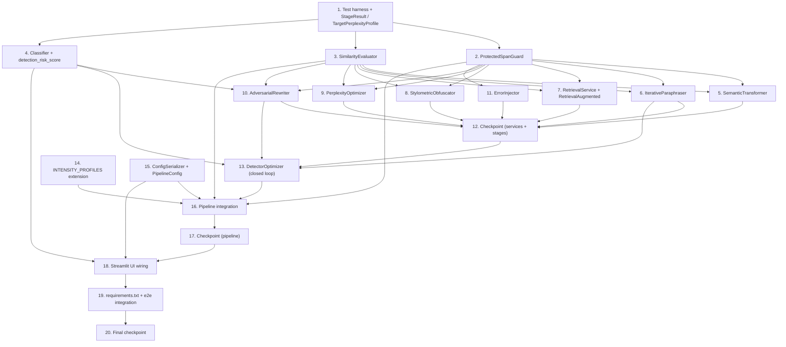

# Implementation Plan: Ultimate Humanizer

## Overview

This plan extends the existing five-stage `HumanizationPipeline` into the fourteen-component
Ultimate Humanizer described in `design.md`. It is built **bottom-up** so every step is grounded in
earlier ones:

1. Shared infrastructure first (`StageResult`, `ProtectedSpanGuard`, `SimilarityEvaluator`,
   `Classifier` + `detection_risk_score`) — every later stage depends on these.
2. The individual new NLP/LLM stages, each conforming to the existing stage contract
   (`__init__(aggression, seed, ...)` + `process(text) -> str`) used by `stage_*.py`.
3. The stateful `DetectorOptimizer` closed loop (depends on the LLM stages + `Classifier`).
4. Pipeline orchestration changes in `humanizer/pipeline.py` (extended stage order,
   discard-on-violation wrapper, progress callbacks, final meaning check).
5. `INTENSITY_PROFILES` extension in `humanizer/config.py` + `ConfigSerializer`.
6. Streamlit UI wiring in `app.py`.
7. `requirements.txt` dependency updates.

By the end, every new component is wired into both the pipeline and the UI — no orphaned code.

### Testing conventions (from design.md → Testing Strategy)

- **Library**: `hypothesis` for property-based tests; `pytest` as the runner. Tests live under a new
  `tests/` directory (e.g. `tests/test_<component>.py`).
- **Iterations**: every property test uses `@settings(max_examples=100)` (or higher).
- **Tagging**: each property test carries a comment in the form
  `# Feature: ultimate-humanizer, Property N: <property text>`.
- **Determinism / offline**: all model- and network-backed dependencies are mocked in property/unit
  tests so they are deterministic and require no network:
  - **LLM stages** — patch the shared `_llm_pass_stream` / `requests.post` (the `stage_llm_rewrite.py`
    SSE pattern) with fakes that return scripted text, raise `RuntimeError`, return empty, or simulate
    a 30 s timeout.
  - **SimilarityEvaluator** — inject a fake evaluator returning scripted scores to force both
    accept and discard paths without loading the embedding model.
  - **Classifier** — inject a fake classifier with scriptable deterministic scores; exercise the real
    model load / 5 s budget / heuristic fallback only in a separately-marked integration test.
  - **RetrievalService** — build in-memory corpora with known embedding vectors so ranking and
    verbatim-span checks are exact.
- Tasks marked with `*` are optional (tests) and can be skipped for a faster MVP; top-level tasks are
  never optional.

## Tasks

- [x] 1. Set up the test harness and shared data models
  - [x] 1.1 Create the `tests/` package and shared test fixtures
    - Create `tests/__init__.py` and `tests/conftest.py`
    - Add a `FakeSimilarityEvaluator` (scriptable `score(a, b)` returning queued values) and a
      `FakeClassifier` (scriptable `score(text)` and a `fail_after` switch) fixture for injection
    - Add a fake LLM helper that patches `humanizer.stage_llm_rewrite.LLMRewriter._llm_pass_stream`
      to yield scripted chunks / raise `RuntimeError` / yield empty
    - _Requirements: 9.2, 9.4 (test infrastructure for deterministic offline runs)_
  - [x] 1.2 Implement `StageResult` and `TargetPerplexityProfile` dataclasses
    - Create `humanizer/results.py` with the `StageResult` dataclass (`text`, `similarity`,
      `risk_before`, `risk_after`, `changed`, `fell_back`, `error`) per Data Models
    - Add `TargetPerplexityProfile` (`target_mean > 0`, `target_variance >= 0`) and a module default
    - _Requirements: 3.1, 6.5_
  - [x] 1.3 Write hypothesis strategies module for reuse across property tests
    - Create `tests/strategies.py`: academic-text strategy that injects `PROTECTED_TERMS`, numbers
      (`3.14`, `42%`), citation markers (`(Smith, 2020)`, `[12]`), and quoted spans; a multi-sentence
      strategy (>=2 / >=3 sentences); an aggression strategy over `floats(0.0, 1.0)`
    - _Requirements: 1.4, 2.3, 5.3, 5.4 (strategies that meaningfully exercise invariance properties)_

- [x] 2. Implement `ProtectedSpanGuard` (protected terms, numbers, citations, quotes)
  - [x] 2.1 Implement the guard in `humanizer/protected_spans.py`
    - `mask(text)` / `unmask(text)` to protect spans before a transformation and restore after:
      whole-word case-sensitive `PROTECTED_TERMS`, numeric values, citation markers
      (`(Author, YEAR)` and `[n]`), and quoted content
    - `verify(original, output) -> dict` returning per-category occurrence-count deltas for the
      pipeline final check
    - Reuse `humanizer.text_analysis.split_sentences` where useful; import `PROTECTED_TERMS` from
      `humanizer.config`
    - _Requirements: 1.4, 2.3, 3.4, 4.2, 5.3, 5.4, 6.4, 7.5, 8.7, 14.2, 14.4_
  - [x] 2.2 Write property test: numeric and citation preservation
    - **Property 2: Numeric and citation preservation** — for all inputs, masking then unmasking
      around an arbitrary edit preserves every numeric value and citation marker with identical
      counts
    - **Validates: Requirements 5.4, 14.4**
  - [x] 2.3 Write unit tests for guard edge cases
    - Quoted-content protection, overlapping spans, citation/number adjacency, empty input
    - _Requirements: 5.4, 14.2, 14.4_

- [x] 3. Implement `SimilarityEvaluator` (embeddings + lexical-proxy fallback)
  - [x] 3.1 Implement `humanizer/similarity.py`
    - `SimilarityEvaluator(model_name="all-MiniLM-L6-v2", cache_size=512)` with lazy model load,
      LRU embedding cache, `is_available()`, and `score(a, b)` returning cosine clamped to `[0.0, 1.0]`
    - Lexical-overlap proxy (token Jaccard / normalized overlap) used when the embedding model cannot
      load, so floors are still enforceable; expose which source was used
    - _Requirements: 6.2, 14.1_
  - [x] 3.2 Write property test: similarity score-range validity
    - **Property 5 (similarity portion): Score-range validity** — for all text pairs, both the
      embedding path (via injected fake) and the lexical-proxy path return a score in `[0.0, 1.0]`
    - **Validates: Requirements 6.2, 14.1**
  - [x] 3.3 Write integration test for the real embedding model (marked, may download model)
    - Sanity-check that near-duplicate text scores higher than unrelated text
    - _Requirements: 14.1_

- [x] 4. Implement `Classifier` and the `detection_risk_score` helper
  - [x] 4.1 Implement `humanizer/classifier.py`
    - `Classifier(model_name=DETECTOR_MODEL, timeout_s=5)`: lazy RoBERTa-style load in
      `torch.no_grad()` eval mode, `is_available()`, `score(text) -> float` in `[0, 100]`
    - Raise `InvalidInput` for empty input or input over 10,000 characters
    - `detection_risk_score(text, classifier) -> (score, source)` centralizing the heuristic fallback
      to `humanizer.text_analysis.compute_ai_risk_score` on load failure / inference error / timeout,
      reporting `source` as `"classifier"` or `"heuristic"`
    - _Requirements: 9.1, 9.2, 9.3, 9.4, 9.6_
  - [x] 4.2 Write property test: classifier invalid-input rejection
    - **Property 17: Classifier invalid-input rejection** — for all empty inputs and inputs over
      10,000 characters, `Classifier.score` raises the invalid-input indication rather than returning
      a number
    - **Validates: Requirements 9.6**
  - [x] 4.3 Write property test: risk score-range validity (classifier + fallback)
    - **Property 5 (risk portion): Score-range validity** — for all valid-length texts, both the fake
      classifier path and the heuristic fallback path produce a score in `[0, 100]`
    - **Validates: Requirements 8.1, 9.1**
  - [x] 4.4 Write example tests: classifier determinism and fallback indication
    - Same loaded (fake) model on identical input yields identical score (Property 4, model portion);
      forced load failure routes to heuristic and reports `source == "heuristic"`
    - _Requirements: 9.2, 9.4_

- [x] 5. Implement `SemanticTransformer` stage (Req 6)
  - [x] 5.1 Implement `humanizer/stage_semantic.py`
    - `SemanticTransformer(aggression, seed, similarity=None, floor=0.90)` following the stage contract
    - Produce a candidate whose character sequence differs for non-empty input; compute `[0,1]`
      similarity; discard candidate (return input) when similarity < 0.90; empty input → unchanged,
      no score; source error/empty → unchanged; preserve protected spans via `ProtectedSpanGuard`
    - Expose `process_measured() -> StageResult`; `process()` delegates and returns text
    - _Requirements: 6.1, 6.2, 6.3, 6.4, 6.6, 6.7, 6.8_
  - [x] 5.2 Add `SemanticTransformer` to the parameterized protected-span suite
    - **Property 1: Protected-span invariance** (this stage) — output preserves every
      `PROTECTED_TERMS` occurrence count
    - **Validates: Requirements 6.4**
  - [x] 5.3 Add `SemanticTransformer` to the parameterized similarity-floor + determinism suites
    - **Property 3: Similarity-floor guarantee** (floor = 0.90 here) and **Property 4: Seed
      determinism** (identical seed + input → identical output), using the injected fake evaluator to
      force accept/discard paths
    - **Validates: Requirements 6.3, 6.6**

- [x] 6. Implement `IterativeParaphraser` stage (Req 1)
  - [x] 6.1 Implement `humanizer/stage_iterative.py`
    - `IterativeParaphraser(aggression, seed, model, api_key, base_url, similarity=None,
      timeout_s=30)`; reuse the `LLMRewriter` SSE/HTTP pattern with a 30 s per-pass timeout
    - Pass count = `1 + round(aggression * 4)`; feed each pass output into the next; discard a pass
      whose similarity vs the stage input < 0.80 and keep the previous pass output
    - LLM error/empty with a prior success → last good pass; first-pass failure with no prior success
      → original text; preserve protected spans
    - Expose `process_measured() -> StageResult`
    - _Requirements: 1.1, 1.2, 1.3, 1.4, 1.5, 1.6, 1.7, 1.8, 1.9_
  - [x] 6.2 Write property test: paraphrase produces divergence
    - **Property 6: Iterative paraphrase produces divergence** — for all non-empty inputs, with at
      least one successful (fake) pass, output Lexical_Divergence from input > 0
    - **Validates: Requirements 1.1**
  - [x] 6.3 Write property test: paraphrase pass-count monotonicity
    - **Property 7: Paraphrase pass-count monotonicity** — for all aggression in `[0,1]`, pass count
      is >=1, <=5, equals 1 at 0.0, reaches 5 at 1.0, and is non-decreasing in aggression
    - **Validates: Requirements 1.2**
  - [x] 6.4 Add `IterativeParaphraser` to the parameterized protected-span + floor + determinism suites
    - **Property 1** (protected spans), **Property 3** (accepted-pass floor = 0.80), **Property 4**
      (seed determinism for non-LLM randomized selection), driven by fakes
    - **Validates: Requirements 1.4, 1.5, 1.7**
  - [x] 6.5 Write example tests: pass chaining and LLM failure recovery
    - Pass output chaining (1.3); LLM error/empty with prior success returns last good pass (1.6);
      first-pass failure with no prior success returns original (1.8); per-pass timeout treated as
      failure (1.9) — all via the fake LLM helper
    - _Requirements: 1.3, 1.6, 1.8, 1.9_

- [x] 7. Implement `RetrievalService` and `RetrievalAugmentedRewriter` stage (Req 7)
  - [x] 7.1 Implement `RetrievalService` and `ReferenceEntry` in `humanizer/retrieval.py`
    - `ReferenceEntry(id, text, source, embedding)`; `RetrievalService(corpus_path, embedder,
      max_results=10)` maintaining a `Reference_Corpus` with precomputed embeddings
    - `retrieve(query_text)` returns up to 10 entries ranked by non-increasing cosine relevance via an
      in-memory NumPy brute-force top-k; empty corpus / no results → empty list
    - Bundle a small default public-domain/openly-licensed corpus file; make the path configurable
    - _Requirements: 7.1, 7.2, 7.4_
  - [x] 7.2 Write property test: retrieval top-k ranking
    - **Property 14: Retrieval top-k ranking** — for all non-empty queries and in-memory corpora with
      known embeddings, the service returns at most 10 passages ordered by non-increasing relevance
    - **Validates: Requirements 7.2**
  - [x] 7.3 Write smoke test: default Reference_Corpus loads
    - Default corpus file loads into at least one `ReferenceEntry`
    - _Requirements: 7.1_
  - [x] 7.4 Implement `RetrievalAugmentedRewriter` in `humanizer/stage_retrieval_augmented.py`
    - Stage-contract class; use retrieved passages as style guidance only in the LLM prompt; reuse the
      `LLMRewriter` SSE pattern with 30 s timeout
    - Post-generation guard rejects any output containing a > 8 consecutive-word span copied verbatim
      from any retrieved passage; corpus empty / no results → input unchanged; source error/empty →
      input unchanged; rewrite similarity < 0.85 → input unchanged; preserve protected spans
    - _Requirements: 7.3, 7.5, 7.6, 7.7, 7.8, 7.9_
  - [x] 7.5 Write property test: verbatim-span bound
    - **Property 15: Verbatim-span bound** — for all stage outputs and retrieved passages, no span of
      more than 8 consecutive words from any retrieved passage appears verbatim in the output
    - **Validates: Requirements 7.7**
  - [x] 7.6 Add `RetrievalAugmentedRewriter` to the protected-span + similarity-floor suites
    - **Property 1** (protected spans) and **Property 3** (floor = 0.85), using fake retrieval +
      fake similarity to force accept/discard paths
    - **Validates: Requirements 7.5, 7.6, 7.9**
  - [x] 7.7 Write example test: rewrite source failure recovery
    - LLM error/empty → input unchanged (7.8) via the fake LLM helper
    - _Requirements: 7.8_

- [x] 8. Implement `StylometricObfuscator` stage (Req 2)
  - [x] 8.1 Implement `humanizer/stage_stylometric.py`
    - NLP-only stage-contract class using `compute_sentence_length_variance` and
      `compute_type_token_ratio` from `humanizer.text_analysis`
    - When aggression > 0 and input has >=2 sentences, shift at least one of {sentence-length
      distribution, function-word frequency, punctuation pattern, type-token ratio} by >=5%; target a
      >=10% increase in sentence-length variance (or within +/-2% when already at the human
      threshold); higher aggression → larger adjustment
    - aggression 0.0 → unchanged; < 2 sentences → unchanged; enforce 0.85 similarity floor (discard
      and return a >=0.85 result, which may be the input); seed-deterministic; preserve protected spans
    - _Requirements: 2.1, 2.2, 2.3, 2.4, 2.5, 2.6, 2.7, 2.8, 2.9_
  - [x] 8.2 Write property test: stylometric attribute shift
    - **Property 8: Stylometric attribute shift** — for all inputs with >=2 sentences and aggression
      > 0, output differs in at least one targeted attribute by >=5%, and sentence-length variance is
      >=10% greater (or within +/-2% at threshold)
    - **Validates: Requirements 2.1, 2.2**
  - [x] 8.3 Write property test: stylometric adjustment monotonicity
    - **Property 9: Stylometric adjustment monotonicity** — for all inputs and seeds, adjustment
      magnitude at higher aggression >= magnitude at any lower aggression
    - **Validates: Requirements 2.5**
  - [x] 8.4 Add `StylometricObfuscator` to the protected-span + floor + determinism suites
    - **Property 1**, **Property 3** (floor = 0.85), **Property 4** (seed determinism)
    - **Validates: Requirements 2.3, 2.4, 2.9, 2.6**

- [x] 9. Implement `PerplexityOptimizer` stage (Req 3)
  - [x] 9.1 Implement `humanizer/stage_perplexity_optimize.py`
    - Stage-contract class accepting a `TargetPerplexityProfile`; use
      `humanizer.text_analysis.estimate_perplexity_score` per sentence
    - Greedily apply candidate edits (simplify/complexify, reusing ideas from `PerplexityVariance`)
      only when they do not increase the absolute distance to target mean (and to target
      cross-sentence variance when >=2 sentences) — guaranteeing the `<=` inequalities
    - Within both tolerances → unchanged; empty/whitespace → unchanged; perplexity unmeasurable →
      unchanged; enforce 0.85 similarity floor; seed-deterministic; preserve protected spans
    - _Requirements: 3.1, 3.2, 3.3, 3.4, 3.5, 3.6, 3.7, 3.8, 3.9_
  - [x] 9.2 Write property test: perplexity distance non-increase
    - **Property 10: Perplexity distance non-increase** — for all non-empty inputs and target
      profiles, output mean-perplexity distance to target <= input's; and for >=2-sentence inputs,
      output variance distance to target <= input's
    - **Validates: Requirements 3.2, 3.3**
  - [x] 9.3 Add `PerplexityOptimizer` to the protected-span + floor + determinism suites
    - **Property 1**, **Property 3** (floor = 0.85), **Property 4** (seed determinism)
    - **Validates: Requirements 3.4, 3.6, 3.7**
  - [x] 9.4 Write example tests: within-tolerance and unmeasurable passthrough
    - Within-tolerance input returned unchanged (3.5); empty/whitespace unchanged (3.8); unmeasurable
      perplexity unchanged (3.9)
    - _Requirements: 3.5, 3.8, 3.9_

- [x] 10. Implement `AdversarialRewriter` stage (Req 4)
  - [x] 10.1 Implement `humanizer/stage_adversarial.py`
    - LLM-backed stage-contract class (reuse `LLMRewriter` SSE/30 s timeout) with `similarity` and
      `classifier` injection; detector-evasion prompt scaled by aggression
    - Score risk on input and candidate with the *same* `detection_risk_score`; return input unchanged
      if candidate similarity < 0.85, if candidate risk > input risk, on LLM error/empty/timeout, or
      on empty/whitespace input; higher aggression → non-decreasing word-change proportion; preserve
      protected spans
    - Expose `process_measured() -> StageResult`
    - _Requirements: 4.1, 4.2, 4.3, 4.4, 4.5, 4.6, 4.7, 4.8_
  - [x] 10.2 Write property test: adversarial risk non-increase
    - **Property 11: Adversarial risk non-increase** — for all inputs with >=1 non-whitespace
      character, output risk (same fake scorer on input and output) <= input risk
    - **Validates: Requirements 4.1, 4.6**
  - [x] 10.3 Write property test: adversarial change monotonicity
    - **Property 12: Adversarial change monotonicity** — for all inputs (fake LLM + seed fixed), word-
      change proportion at higher aggression >= proportion at any lower aggression
    - **Validates: Requirements 4.4**
  - [x] 10.4 Add `AdversarialRewriter` to the protected-span + similarity-floor suites
    - **Property 1** and **Property 3** (floor = 0.85), forcing discard via fake similarity
    - **Validates: Requirements 4.2, 4.3, 4.5**
  - [x] 10.5 Write example test: LLM failure / risk-increase fallback
    - LLM error/empty/timeout → input unchanged (4.7); candidate risk > input risk → input unchanged
      (4.6) via fake LLM + fake classifier
    - _Requirements: 4.6, 4.7_

- [x] 11. Implement `ErrorInjector` stage (Req 5)
  - [x] 11.1 Implement `humanizer/stage_error_injector.py`
    - NLP-only stage-contract class; inject minor punctuation variations, whitespace variations, and
      informal word-form substitutions at a rate monotonic in aggression, capped at
      `floor(0.05 * word_count)` words
    - Mask numbers, citations, quoted content, and `PROTECTED_TERMS` via `ProtectedSpanGuard` before
      injection so they are never altered; aggression 0.0 → unchanged; empty/whitespace → unchanged;
      seed-deterministic
    - _Requirements: 5.1, 5.2, 5.3, 5.4, 5.5, 5.6, 5.7, 5.8_
  - [x] 11.2 Write property test: error-injection bound and monotonicity
    - **Property 13: Error-injection bound and monotonicity** — for all inputs, altered words
      <= `floor(0.05 * word_count)`, zero when that bound < 1, and non-decreasing in aggression up to
      the bound
    - **Validates: Requirements 5.1, 5.2, 5.8**
  - [x] 11.3 Add `ErrorInjector` to the protected-span, numeric/citation, and determinism suites
    - **Property 1** (protected spans), **Property 2** (numbers + citations preserved),
      **Property 4** (seed determinism)
    - **Validates: Requirements 5.3, 5.4, 5.6**

- [x] 12. Checkpoint - shared services and individual stages
  - Ensure all tests pass, ask the user if questions arise.

- [x] 13. Implement `DetectorOptimizer` closed-loop stage (Req 8)
  - [x] 13.1 Implement `humanizer/stage_detector_optimizer.py`
    - Stage-contract class with `classifier`, `similarity`, `target_threshold` (0-100),
      `max_iterations` (1-20) injection; reuse `AdversarialRewriter` / `IterativeParaphraser` for
      candidate generation with `seed = base_seed + iteration`
    - Implement the loop: compute risk `[0,100]` for input and each candidate; iterate until target
      threshold reached or max iterations hit; return the lowest-risk candidate among those with
      similarity >= 0.85; none qualifying → input unchanged; preserve protected spans; on classifier
      failure mid-loop stop, return best valid candidate (or input), and set `StageResult.error`
    - Expose `process_measured() -> StageResult`
    - _Requirements: 8.1, 8.2, 8.3, 8.4, 8.5, 8.6, 8.7, 8.8_
  - [x] 13.2 Write property test: optimizer selection and iteration bound
    - **Property 16: Detector-optimizer selection and iteration bound** — for all inputs and generated
      candidates, returns lowest-risk candidate with similarity >= 0.85, returns input when none
      qualifies, performs no more than `max_iterations` iterations, and stops early at target
    - **Validates: Requirements 8.2, 8.3, 8.4, 8.5, 8.6**
  - [x] 13.3 Add `DetectorOptimizer` to the protected-span suite
    - **Property 1: Protected-span invariance** (this stage)
    - **Validates: Requirements 8.7**
  - [x] 13.4 Write example test: mid-loop classifier failure handling
    - Fake classifier set to fail after N calls → loop stops, returns best valid candidate (or input),
      surfaces error via `StageResult.error`
    - _Requirements: 8.8_

- [x] 14. Extend `INTENSITY_PROFILES` for the nine new stages (Req 11)
  - [x] 14.1 Add enabled flags and aggression values per level in `humanizer/config.py`
    - For each level 1-5 add, for each new stage key (`semantic_transform`, `iterative_paraphrase`,
      `retrieval_augmented`, `stylometric`, `perplexity_optimize`, `adversarial`, `error_injection`,
      `detector_optimize`, and the `classifier` enabled flag), a boolean enabled flag and an
      `<key>_aggression` float in `[0,1]`, monotonic non-decreasing across levels (use the design's
      illustrative table)
    - Add the default `TargetPerplexityProfile` values
    - _Requirements: 11.1, 11.3_
  - [x] 14.2 Write property test: intensity profile structure and monotonicity
    - **Property 19: Intensity profile structure and monotonicity** — for all levels 1-5 and all nine
      new stages, an enabled boolean and aggression float in `[0,1]` exist, and aggression at L+1 >=
      aggression at L for L in 1..4
    - **Validates: Requirements 11.1, 11.3**

- [x] 15. Implement `ConfigSerializer` and `PipelineConfig` (Req 13)
  - [x] 15.1 Implement `humanizer/config_serializer.py`
    - `PipelineConfig` capturing intensity (1-5), every Stage_Toggle, both `TargetPerplexityProfile`
      values, and every per-stage aggression (`[0,1]`)
    - `ConfigSerializer.serialize(config) -> str` (JSON per the design schema) and
      `deserialize(blob) -> PipelineConfig` raising `ConfigError(field)` on a missing field or
      out-of-range value, leaving the active configuration unchanged
    - _Requirements: 13.1, 13.2, 13.4_
  - [x] 15.2 Write property test: config round-trip equivalence
    - **Property 22: Config round-trip equivalence** — for all valid configs (hypothesis-generated),
      `deserialize(serialize(c))` equals `c` field-by-field across intensity, every toggle, both
      profile values, and every per-stage aggression
    - **Validates: Requirements 13.1, 13.2, 13.3**
  - [x] 15.3 Write property test: config invalid-field rejection
    - **Property 23: Config invalid-field rejection** — for all representations with a missing field
      or out-of-range value, `deserialize` raises an error naming the invalid field
    - **Validates: Requirements 13.4**

- [x] 16. Integrate new stages into `HumanizationPipeline` (Req 10, 14)
  - [x] 16.1 Extend stage registry and `get_enabled_stages()` in `humanizer/pipeline.py`
    - Add the nine new keys to `STAGE_NAMES` and define the canonical 13-stage `STAGE_ORDER` from the
      design (Structural, Lexical, Semantic_Transformer, Iterative_Paraphraser, LLM Rewrite,
      Retrieval_Augmented, Stylometric_Obfuscator, Perplexity Variance, Perplexity_Optimizer,
      Adversarial_Rewriter, Error_Injector, Post-processing, Detector_Optimizer)
    - Update `get_enabled_stages()` to read the extended profile and apply `stage_overrides`
    - Construct shared `SimilarityEvaluator` and `Classifier` once and inject into the stages that need
      them; pass `seed` to every non-LLM-random stage
    - _Requirements: 10.1, 10.2, 10.3, 10.8_
  - [x] 16.2 Implement the discard-on-violation wrapper and progress/error semantics
    - Wrap each new stage: emit `progress_callback(stage, "running")` before and `"complete"` after an
      enabled stage; emit nothing for skipped stages; on unhandled stage error keep the last good text,
      emit `"error"`, and continue
    - Backstop each accepted candidate against `ProtectedSpanGuard` and the stage's similarity floor,
      keeping the input on violation; capture `StageResult` analytics for the UI
    - All stages disabled → input unchanged; empty/whitespace input → input unchanged
    - Mirror the same ordering/wrapping in `process_stream` so streaming output stays consistent
    - _Requirements: 10.4, 10.5, 10.6, 10.7, 10.9, 10.10_
  - [x] 16.3 Implement intensity clamping/rounding and final meaning-preservation check
    - Clamp intensity below 1 to 1 and above 5 to 5; round non-integer values to nearest level with
      halves rounding up; apply resolved profile enabled flags + aggression; Stage_Toggle override
      decides execution while still applying the profile aggression
    - After the last stage, compute final similarity between the *original* input and final output
      (`[0,1]`); if < 0.85 still return output but surface a warning; run `ProtectedSpanGuard.verify`
      and surface a warning if any protected term, numeric value, or citation marker count dropped
    - _Requirements: 11.2, 11.4, 11.5, 11.6, 14.1, 14.3, 14.5_
  - [x] 16.4 Write property test: pipeline executed-set and deterministic order
    - **Property 18: Pipeline executed-set and deterministic order** — for all configs and inputs,
      executed stages equal the enabled set, appear in canonical order, are identical across runs, emit
      no callback for skipped stages, and return input unchanged when all stages are disabled (fakes
      injected for model-backed stages)
    - **Validates: Requirements 10.1, 10.2, 10.3, 10.6, 10.9**
  - [x] 16.5 Write property test: intensity application, clamping, and rounding
    - **Property 20: Intensity application, clamping, and rounding** — for all requested intensity
      values, resolved enabled flags/aggression are applied; <1 clamps to 1, >5 clamps to 5; non-
      integers round to nearest with halves up
    - **Validates: Requirements 11.2, 11.5, 11.6**
  - [x] 16.6 Write property test: stage-toggle override semantics
    - **Property 21: Stage-toggle override semantics** — for all configs with a toggle override, the
      override decides execution while the profile aggression still applies
    - **Validates: Requirements 11.4**
  - [x] 16.7 Add the full Pipeline to the protected-span suite and write the final-check property
    - **Property 1: Protected-span invariance** (full pipeline) and **Property 5 (similarity portion)**
      for the final score range; assert final similarity score in `[0,1]`
    - **Validates: Requirements 14.1, 14.2**
  - [x] 16.8 Write example tests: progress sequencing, seed wiring, and warning surfaces
    - Running→complete callback sequencing (10.4, 10.5); skipped-stage emits nothing (10.6); seed
      passed to non-LLM-random stages (10.8); below-0.85 final similarity warning (14.3); dropped
      number/citation warning (14.5)
    - _Requirements: 10.4, 10.5, 10.6, 10.8, 14.3, 14.5_

- [x] 17. Checkpoint - pipeline integration
  - Ensure all tests pass, ask the user if questions arise.

- [x] 18. Wire new controls and analytics into the Streamlit frontend (`app.py`, Req 12)
  - [x] 18.1 Add nine Stage_Toggle controls and Target_Perplexity_Profile inputs
    - Extend the Advanced Settings expander with one checkbox per new capability, each defaulting to
      its Intensity_Profile enabled flag and overriding it when changed; add target-mean and
      target-variance number inputs; pass all into `HumanizationPipeline` via `stage_overrides` and the
      target profile
    - _Requirements: 12.1_
  - [x] 18.2 Update progress display and before/after analytics
    - Update each enabled stage's status to running/complete on each `Progress_Callback`; on completion
      display before/after `Detection_Risk_Score` (0-100) via `detection_risk_score` and the final
      `Semantic_Similarity_Score` (0.0-1.0) between original and final text; show the estimate
      disclaimer
    - _Requirements: 12.2, 12.3, 12.4, 12.5_
  - [x] 18.3 Wire export control and run-error handling
    - Export produces a downloadable file with the full final text; keep the export control disabled
      until a run completes in the session; on run error show an error indication and retain the last
      successful analytics
    - _Requirements: 12.6, 12.7, 12.8_
  - [x] 18.4 Wire config save/load via `ConfigSerializer`
    - Save downloads the JSON from `ConfigSerializer.serialize`; load uploads → `deserialize`; on a
      field error display which field was invalid and keep the current active configuration
    - _Requirements: 13.4_
  - [x] 18.5 Extract testable UI helpers and write example/UI tests
    - Extract thin helper functions (build stage_overrides, compute analytics payload, export payload,
      export-disabled state) from `app.py`; test toggle reflect/override (12.1), status updates (12.2),
      before/after analytics (12.3, 12.4), export payload + disabled state (12.6, 12.8), error
      retention (12.7), and disclaimer presence (12.5) via `streamlit.testing.AppTest` where feasible
    - _Requirements: 12.1, 12.2, 12.3, 12.4, 12.5, 12.6, 12.7, 12.8_

- [x] 19. Update dependencies and end-to-end integration test
  - [x] 19.1 Update `requirements.txt` and add dev dependencies
    - Add runtime deps `sentence-transformers`, `transformers`, `torch`, `numpy`; create
      `requirements-dev.txt` with `hypothesis`, `pytest`, and optional `faiss-cpu`
    - Confirm graceful degradation paths so the original five-stage pipeline still runs if the new
      model deps are absent
    - _Requirements: 9.4, 14.1 (degradation-backed dependency wiring)_
  - [x] 19.2 Write end-to-end integration test (mocked LLM, all stages enabled)
    - Full pipeline run with fakes for LLM/embedding/classifier asserting protected-term, numeric, and
      citation preservation plus final similarity reporting; smoke-check the profile table is
      well-formed for all five levels and the disclaimer text is present
    - _Requirements: 10.1, 12.5, 14.1, 14.2, 14.4_

- [x] 20. Final checkpoint - full system
  - Ensure all tests pass, ask the user if questions arise.

## Task Dependency Graph



## Notes

- Tasks marked with `*` are optional (tests) and can be skipped for a faster MVP; all top-level tasks
  are required and never optional.
- Every new component is wired into the pipeline (Task 16) and the UI (Task 18) before completion, so
  no orphaned code remains.
- Parameterized correctness properties (Property 1 protected-span, Property 3 similarity-floor,
  Property 4 determinism, Property 5 score-range) are implemented as shared parameterized suites that
  each stage is added to in its own sub-task, keeping property tests close to the implementation.
- Stage-specific properties (6-16, 18-23) each have a dedicated property-test sub-task referencing the
  design property number and the requirements it validates.
- All model-, LLM-, embedding-, and retrieval-backed dependencies are mocked in property/unit tests
  for deterministic offline runs; real models are exercised only in separately-marked integration
  tests.
- This workflow produces planning artifacts only. To implement, open `tasks.md` and click
  "Start task" next to a task item.
```
